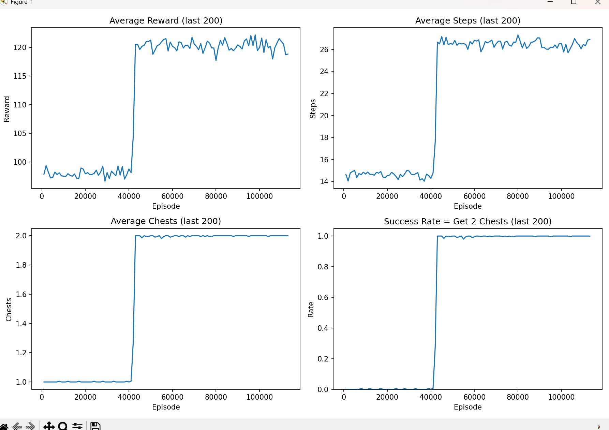
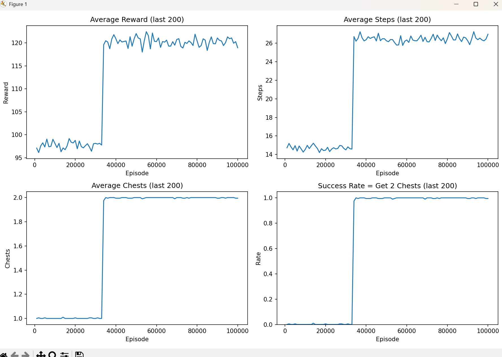
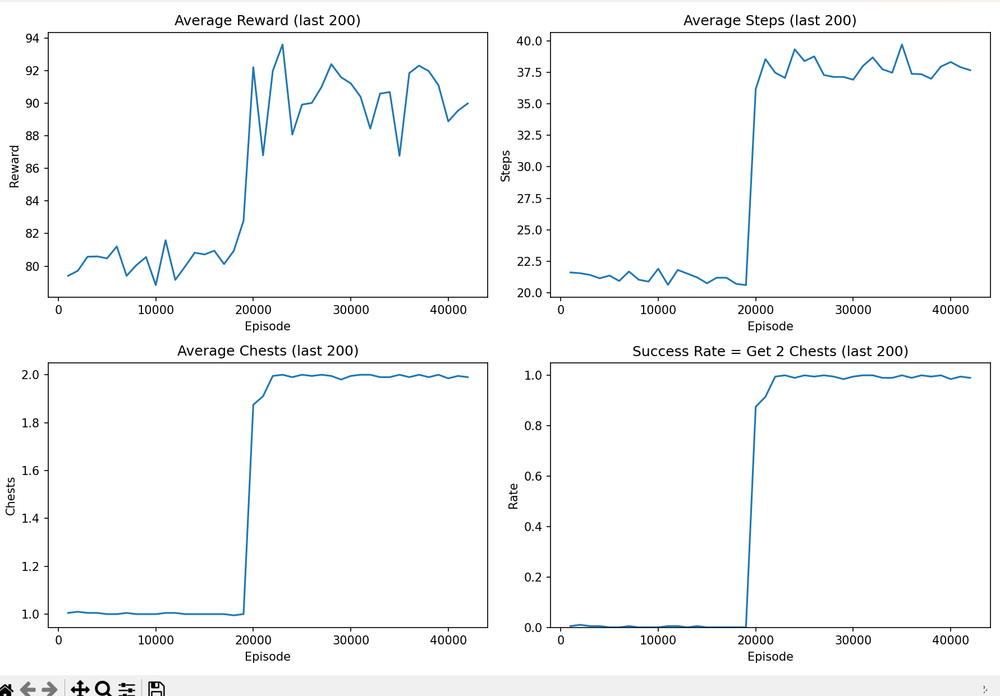
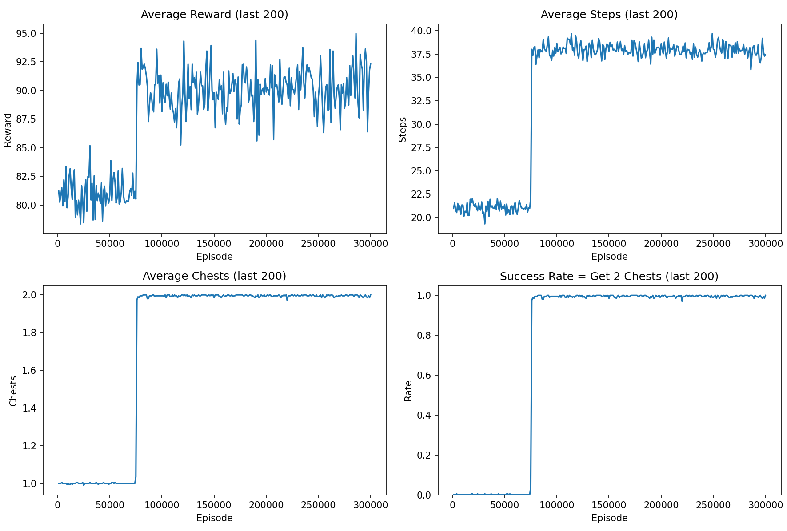

# 对于简单强化学习各个参数的研究

## 当参数为 alpha=0.2, gamma=0.99, epsilon=0.3 时，训练结果如下，有时候在6万次便可以找到所有宝箱，但有时后却在50万次甚至更高

## 若我们将参数alpha(学习率)提高时, 可以发现训练次数明显减少 (alpha=0.3, gamma=0.99, epsilon=0.3)

## 若我们将参数epsilon随机度提高时, 也可以发现训练次数明显减少,但是方差变高了，有时候1万次时便可测试成功，有时却要10万次以上但平均在3万次 (alpha=0.2, gamma=0.99, epsilon=0.5)

